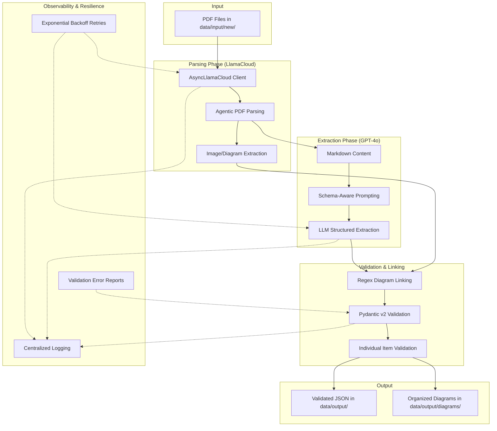

11# llama-pydantic-extraction

Production-ready pipeline for extracting structured data from large PDF corpora. Combines LlamaCloud's intelligent parsing with Pydantic's type-safe validation to transform unstructured documents into validated Python objects at scale. Async processing, batch optimization, schema-driven extraction.

---

## Features

- **AI-Powered Parsing** — LlamaCloud handles complex PDF layouts, tables, and mixed content.
- **Schema-Driven Extraction** — Define what you need with Pydantic models; get validated, typed output.
- **Async & Batch Processing** — Process hundreds of PDFs concurrently with built-in rate limiting.
- **Diagram Integration** — Automatically downloads and links diagrams/images to specific questions.
- **Robust Error Handling** — Retries with exponential backoff, detailed logging, and graceful failure modes.

## Project Architecture



## Project Structure

```text
llama-pydantic-extraction/
├── main.py                          # Application entry point
├── config/
│   └── settings.py                  # Centralised configuration & env loading
├── src/
│   ├── extractors/                  # LLM extraction logic & diagram linking
│   ├── parsers/                     # PDF parsing (LlamaCloud integration)
│   ├── schemas/                     # Pydantic models (MCQs & metadata)
│   └── utils/                       # Shared helpers — logging, file I/O, async
├── scripts/                         # CLI scripts for batch ops & validation
├── data/
│   ├── input/new/                   # Place source PDFs here
│   └── output/                      # Validated JSON output lands here
│       └── diagrams/                # Extracted images organized by PDF
└── tests/                           # Unit and integration tests
```

## Getting Started

### Prerequisites

- Python 3.9+
- A [LlamaCloud API key](https://cloud.llamaindex.ai/)

### Installation

```bash
git clone https://github.com/Arv-ind-s/llama-pydantic-extraction.git
cd llama-pydantic-extraction
python -m venv venv && source venv/bin/activate
pip install -r requirements.txt
```

### Configuration

Copy the example environment file and add your API key:

```bash
cp .env.example .env
```

```env
LLAMA_CLOUD_API_KEY=llx-your-key-here
LLM_MODEL=gpt-4o
BATCH_SIZE=5
MAX_RETRIES=3
LOG_LEVEL=INFO
```

## Usage

### 1. Run the Full Pipeline
Place your PDF files in the `data/input/new/` folder and run the main pipeline:

```bash
python main.py
```
Extracted, validated data will be written to `data/output/` as timestamped JSON files.

### 2. Utility Scripts
The project includes several CLI utilities in the `scripts/` directory:

| Command | Description |
| :--- | :--- |
| `python scripts/stats.py` | Display statistics of extracted questions and processing success. |
| `python scripts/export_csv.py` | Flatten and export validated JSON results to a CSV file. |
| `python scripts/validate_output.py` | Re-run Pydantic validation on all JSON files in the output directory. |
| `python scripts/reprocess.py <file.pdf>` | Re-run parsing and extraction for a specific PDF. |
| `python scripts/clean_output.py` | Archive or delete files in the output directory. |

## Testing

```bash
# Run all tests
pytest

# Unit tests only
pytest tests/unit/
```

## Engineering Standards

- **Pydantic v2**: Strict model enforcement with `model_dump()` and `ConfigDict`.
- **Async First**: All I/O operations are non-blocking using `asyncio` and `httpx`.
- **Surgical Validation**: Invalid questions are logged and skipped, ensuring one bad item doesn't fail a 100-item document.
- **Resilience**: Exponential backoff retries for all external API dependencies.

## License

MIT
